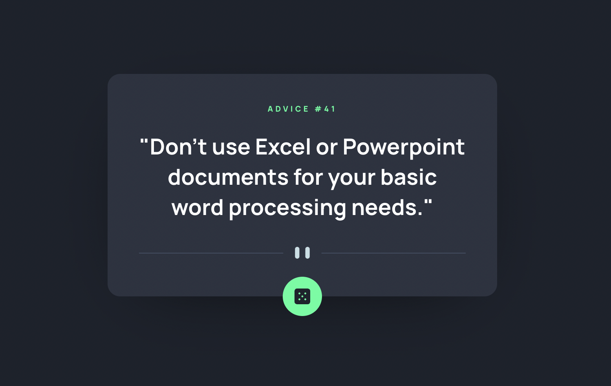

# Frontend Mentor - Advice generator app solution

This is a solution to the [Advice generator app challenge on Frontend Mentor](https://www.frontendmentor.io/challenges/advice-generator-app-QdUG-13db). Frontend Mentor challenges help you improve your coding skills by building realistic projects.

## Table of contents

- [Overview](#overview)
  - [Screenshot](#screenshot)
  - [Links](#links)
- [My process](#my-process)
  - [Built with](#built-with)
- [Author](#author)

## Overview

### Screenshot

### Links

- Solution URL: [Ir](https://6277def4e0a01b5bffdfc53d--sparkly-kataifi-a7e1ab.netlify.app/)
- Live Site URL: [Ir](https://6277def4e0a01b5bffdfc53d--sparkly-kataifi-a7e1ab.netlify.app/)

## My process

### Built with

- Flexbox
- [React](https://reactjs.org/) - JS library

## Author

- Website - [Emilio Suárez](https://www.emisua.dev)
- Frontend Mentor - [@emisua](https://www.frontendmentor.io/profile/emisua)
- Github - [@emisua](https://github.com/emisua)